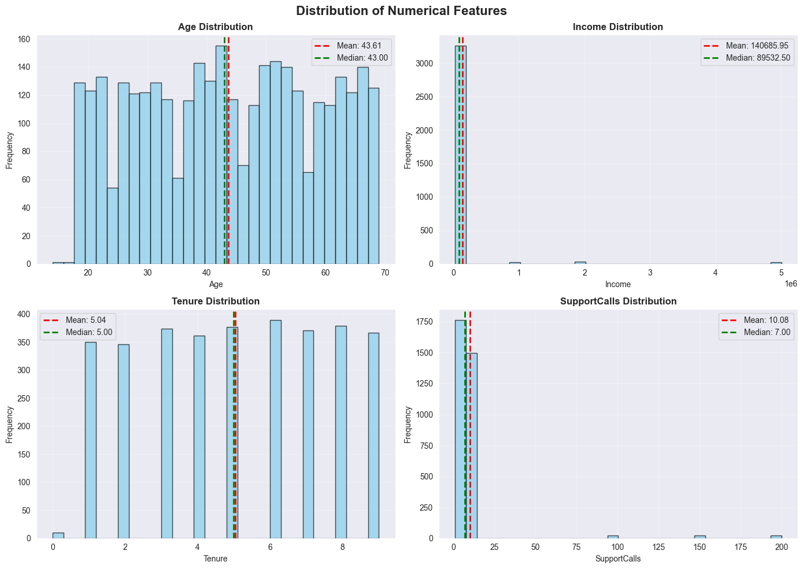
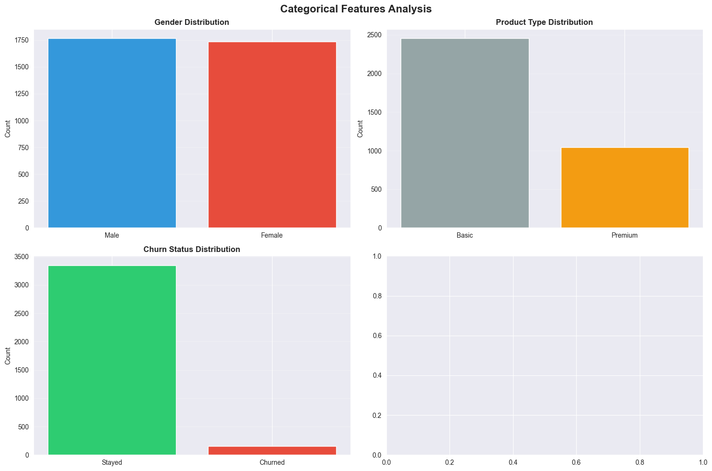
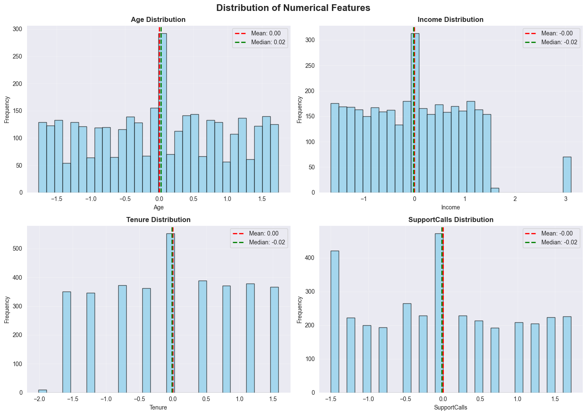
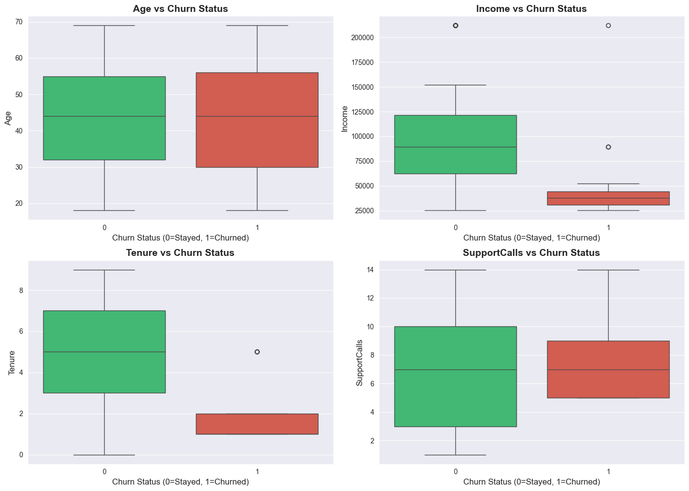
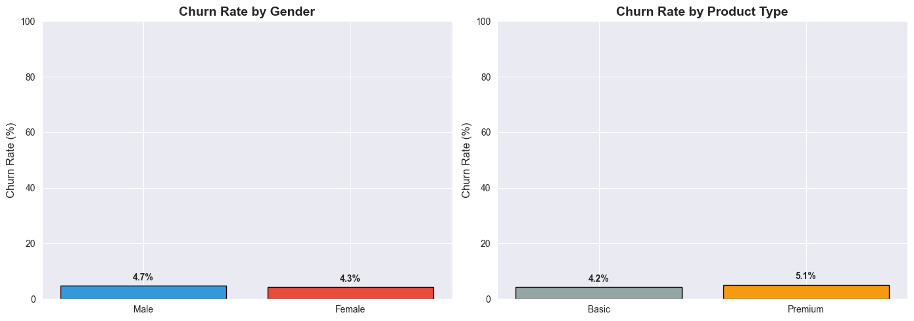

# Customer Data Preprocessing and Exploratory Data Analysis (EDA)
---
# 
------------[churn-ml](https://churn-ml.streamlit.app/)------------

- is a Streamlit web app that showcases the entire data preprocessing and exploratory data analysis (EDA) process, including justifications, visualizations, and insights derived from the customer dataset.
---
## Table of Contents
1. [Project Overview](#project-overview)
2. [Dataset Description](#dataset-description)
3. [Data Inspection](#data-loading-and-inspection)
4. [Handling Missing Data](#handling-missing-data)
5. [Handling Outliers](#handling-outliers)
6. [Feature Scaling](#feature-scaling)
7. [Data Visualizations](#data-visualizations)
8. [Conclusion](#conclusion)
9. [Tools Used](#tools-used)
10. [Contribution](#contribution)

---

## 1. Project Overview

This project focuses on **Data Preprocessing** and **Exploratory Data Analysis (EDA)** for a **Customer Churn Dataset**.  
The dataset simulates real-world customer information, including demographics, product usage, and churn behavior, to help identify key patterns influencing customer retention.

The main objectives of this project are to:
- **Clean and preprocess** the dataset by handling missing values and outliers.  
- **Normalize and scale** numerical features to prepare data for future machine learning models.  
- **Perform exploratory data analysis (EDA)** through visualizations to understand variable distributions and relationships.  
- **Identify correlations** between customer attributes and churn status to support churn prediction and business insights.

All analysis was implemented in **Python** using libraries such as `pandas`, `matplotlib`, and `seaborn`.  
The complete preprocessing pipeline and justifications are also showcased in the hosted Streamlit web app:  
-> [**churn-ml**](https://churn-ml.streamlit.app/)

## 2. Dataset Description

The dataset used in this project is a **synthetic customer churn dataset** that simulates a company’s customer database.  
It includes both **demographic** and **behavioral** attributes that describe customers’ profiles, service usage, and churn tendencies.

### **Dataset Features**

| Feature | Type | Description |
|----------|------|-------------|
| **CustomerID** | Numeric | Unique identifier for each customer. |
| **Age** | Numeric | Age of the customer in years. |
| **Gender** | Categorical | Gender of the customer (`0`: Male, `1`: Female). |
| **Income** | Numeric | Annual income of the customer (in USD). |
| **Tenure** | Numeric | Number of years the customer has been with the company. |
| **ProductType** | Categorical | Type of product the customer subscribed to (`0`: Basic, `1`: Premium). |
| **SupportCalls** | Numeric | Number of support calls made by the customer in the last year. |
| **ChurnStatus** | Binary | Target variable — indicates if the customer churned (`1`) or stayed (`0`). |

### **Purpose**

This dataset provides the foundation for:
- Detecting and handling missing data and outliers.  
- Analyzing patterns in customer demographics and service behavior.  
- Exploring relationships between independent variables and the **ChurnStatus** target variable.  
- Building insights that can guide future **machine learning models** for churn prediction and customer retention strategies.

## 3. Data Inspection

The dataset was first **loaded into a pandas DataFrame** for exploration and verification of its structure.  
Initial inspection steps included displaying the first few rows using `.head()` and retrieving dataset metadata using `.info()`.  
This helped verify the presence of all expected columns, data types, and identify any potential inconsistencies such as null values or incorrect data types.

### Sample of the Dataset (`head()`)

| CustomerID   |   Age |   Gender |   Income |   Tenure |   ProductType |   SupportCalls |   ChurnStatus |
|:-------------|------:|---------:|---------:|---------:|--------------:|---------------:|--------------:|
| CUST0000     |    59 |        0 |   151203 |        4 |             0 |              1 |             0 |
| CUST0001     |    69 |        0 |    58332 |        6 |             1 |              9 |             0 |
| CUST0002     |    46 |        1 |   149481 |        2 |             0 |             12 |             0 |
| CUST0003     |    32 |        1 |   115937 |        1 |             1 |             13 |             0 |
| CUST0004     |    60 |        0 |   103929 |        4 |             1 |              5 |             0 |
| CUST0005     |    25 |        1 |    94206 |        7 |             1 |             13 |             0 |
| CUST0006     |    38 |        1 |   116137 |        6 |             0 |              5 |             0 |

### Dataset Information (`data.info()`)

| Property | Details |
|-----------|----------|
| **Entries** | 3500 rows (index range 0–3499) |
| **Columns** | 8 total |
| **Memory Usage** | 218.9 KB |
| **Data Types** | 4 float64, 3 int64, 1 object |

| Column | Non-Null Count | Dtype |
|:--------|---------------:|:------|
| CustomerID | 3500 | object |
| Age | 3325 | float64 |
| Gender | 3500 | int64 |
| Income | 3328 | float64 |
| Tenure | 3325 | float64 |
| ProductType | 3500 | int64 |
| SupportCalls | 3329 | float64 |
| ChurnStatus | 3500 | int64 |

Summary statistics were generated using `.describe()` to understand the **central tendency**, **spread**, and **distribution** of numerical variables such as `Age`, `Income`, `Tenure`, and `SupportCalls`.  
This step provided valuable insights into data range, mean, median, and potential outliers before applying preprocessing techniques.

### Summary Statistics (`data.describe()`)

| Statistic | Age | Gender | Income | Tenure | ProductType | SupportCalls | ChurnStatus |
|:-----------|----:|-------:|-------:|-------:|-------------:|--------------:|-------------:|
| **Count** | 3325 | 3500 | 3328 | 3325 | 3500 | 3329 | 3500 |
| **Mean** | 43.61 | 0.50 | 140686 | 5.04 | 0.30 | 10.08 | 0.04 |
| **Std** | 14.93 | 0.50 | 433327 | 2.57 | 0.46 | 21.74 | 0.21 |
| **Min** | 14 | 0 | 25037 | 0 | 0 | 1 | 0 |
| **25%** | 31 | 0 | 56530 | 3 | 0 | 3 | 0 |
| **50%** | 43 | 0 | 89533 | 5 | 0 | 7 | 0 |
| **75%** | 56 | 1 | 121502 | 7 | 1 | 11 | 0 |
| **Max** | 69 | 1 | 5.00×10⁶ | 9 | 1 | 200 | 1 |

Additionally, categorical attributes like `Gender` and `ProductType` were briefly reviewed using `.value_counts()` to confirm class balance and ensure proper encoding readiness.  

Finally, data where printed using `matplotlib` to clearly visulaize it
### Data Visualization

#### Numerical Data

#### Categorical Data

Overall, this stage ensured that the dataset was structurally sound and ready for the next preprocessing steps involving missing data and outlier handling.

## 4. Handling Missing Data

Before applying any preprocessing, the dataset was checked for null or missing values using the `.isnull().sum()` method.  
The inspection revealed that several numerical features contained missing entries, while all categorical features were complete.

To ensure consistency and prevent data loss, **imputation** was used instead of dropping rows.  
Each feature was handled based on its distribution and statistical characteristics as follows:

| Feature | Missing Values | Handling Method | Justification |
|:----------|:----------------:|:----------------|:----------------|
| **Age** | 175 | Replaced with **median age** | The age distribution was slightly skewed; using the median prevents distortion from extreme values. |
| **Income** | 172 | Replaced with **median income** | Median was preferred over mean to handle the presence of a few very high incomes. |
| **Tenure** | 175 | Replaced with **median tenure** | Median imputation preserves the central tendency of the customer tenure feature without being affected by variability. |
| **SupportCalls** | 171 | Replaced with **mean support calls** | The distribution was approximately uniform, making the mean a suitable replacement for missing values. |
| **Gender**, **ProductType**, **ChurnStatus**, **CustomerID** | 0 | No handling required | These features were complete with no missing values detected. |

After imputation, all columns were rechecked to confirm that no missing values remained in the dataset.  
This step ensured a **clean and consistent dataset** ready for outlier detection and feature scaling.

## 5. Handling Outliers

Outlier detection was performed on all numerical features using both **box plots** and the **Interquartile Range (IQR)** method to identify unusually high or low values that could skew the analysis.  
The treatment method varied depending on the feature characteristics and the number of detected outliers.

| Feature | Detection Method | Handling Approach | Justification |
|:----------|:------------------|:------------------|:----------------|
| **Age** | IQR (Boxplot) | **Removed** two outlier records (Age < 18) | These entries were unrealistic for the dataset’s customer context and were too few to impact data balance. |
| **Income** | IQR + Z-score | **Capped** extreme high values to the upper whisker boundary | Prevents exceptionally high income values from distorting statistical measures while preserving all records. |
| **SupportCalls** | IQR | **Replaced** extreme values with the **median** | Some customers had unusually high support call counts; replacing them with the median ensured consistent scaling. |
| **Tenure** | IQR | **No outliers detected** | All values fell within a reasonable range, so no modification was necessary. |
| **Categorical Features** (`Gender`, `ProductType`, `ChurnStatus`) | — | Not applicable | These are categorical variables, so outlier detection does not apply. |

Overall, the outlier handling process balanced **data integrity and statistical reliability** by addressing extreme deviations without removing large portions of the dataset.

## 6. Feature Scaling

After handling missing data and outliers, the next preprocessing step was **feature scaling** to ensure all numerical features contributed equally to the analysis and were on a comparable scale.

The **Z-score normalization (Standardization)** technique was applied to the numerical columns — `Age`, `Income`, `Tenure`, and `SupportCalls`.  
This method transforms the data so that each feature has a **mean of 0** and a **standard deviation of 1**, using the formula:

`z = (x - μ) / σ`

where:  
- \( x \) = original feature value  
- \( \mu \) = feature mean  
- \( \sigma \) = feature standard deviation  

| Feature | Scaling Method | Reason |
|:----------|:------------------|:------------------|
| **Age** | Z-score normalization | Standardizes varying age ranges and supports fair comparison. |
| **Income** | Z-score normalization | Handles large numeric scale differences and prevents high income values from dominating. |
| **Tenure** | Z-score normalization | Ensures consistency with other continuous features. |
| **SupportCalls** | Z-score normalization | Normalizes frequency variations across customers. |
| **Categorical Features** (`Gender`, `ProductType`, `ChurnStatus`) | Not scaled | These are non-numeric categories or binary variables and do not require scaling. |

This step improved the dataset’s suitability for further **statistical analysis** and **machine learning models** by reducing feature magnitude bias.

## 7. Data Visualizations

To explore feature distributions and relationships, several visualizations were created to summarize both numerical and categorical data.  
These plots provide insights into feature balance, spread, and potential correlations with the target variable (`ChurnStatus`).

### **7.1 Categorical Feature Distributions**
Bar plots showing the frequency and ratio of each category for `Gender`, `ProductType`, and `ChurnStatus`.

### **7.2 Numerical Feature Distributions**
Histograms displaying the spread and shape of numerical features such as `Age`, `Income`, `Tenure`, and `SupportCalls`.

### **7.3 Numerical Boxplots**
Boxplots representing variability and remaining potential outliers (after cleaning) across all numerical features.

### **7.4 Categorical Ratios**
Bar plots comparing churn ratios across categorical variables (`Gender` and `ProductType`).

---

## 8. Conclusion

Through a complete data preprocessing and exploratory data analysis (EDA) process, the customer churn dataset was successfully cleaned, standardized, and visualized to extract meaningful insights.

Key outcomes of this analysis include:
- **Data Quality Improvement:** Missing values were handled using statistical imputation (mean and median), and outliers were properly treated to preserve data integrity.  
- **Feature Normalization:** Z-score standardization ensured that all numerical features were on a comparable scale, preventing dominance by variables with larger numeric ranges.  
- **Balanced Understanding of Data:** Visualizations revealed balanced distributions in categorical variables and realistic ranges in numerical ones after cleaning.  
- **Preliminary Insights:**  
  - Higher support call counts and lower tenure values appeared more common among churned customers.  
  - Premium product users showed slightly lower churn rates compared to basic users.  
  - No severe data imbalance was observed between male and female customers.

Overall, the dataset is now **fully prepared for machine learning modeling**, and the analysis provided a solid foundation for identifying behavioral and demographic patterns related to customer churn.

## 9. Tools Used

The following tools and libraries were utilized throughout the data preprocessing and exploratory data analysis (EDA) stages:

| Category | Tools / Libraries | Purpose |
|:-----------|:------------------|:----------|
| **Programming Language** | `Python 3.10+` | Main language used for data manipulation, analysis, and visualization. |
| **Data Manipulation** | `pandas`, `numpy` | Cleaning, handling missing values, outlier detection, and feature scaling. |
| **Data Visualization** | `matplotlib`, `seaborn` | Creating plots such as histograms, bar charts, and boxplots for EDA. |
| **Statistical Analysis** | `scipy.stats` | Applied Z-score normalization and statistical checks. |
| **Web App Deployment** | `Streamlit` | Hosted interactive visualizations and preprocessing steps on the [**churn-ml**](https://churn-ml.streamlit.app/) web app. |
| **Environment** | `Jupyter Notebook` | Used for interactive code execution, analysis documentation, and visualization rendering. |

## 10. Contribution
- [Heba Mustafa](https://github.com/Mustafa112H)
- [Abdalraheem Shuaibi](https://github.com/AbdSh17)
